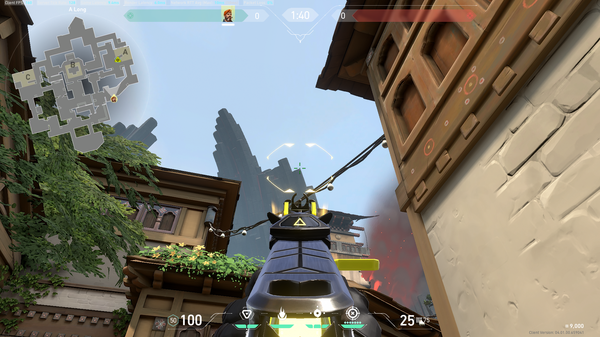
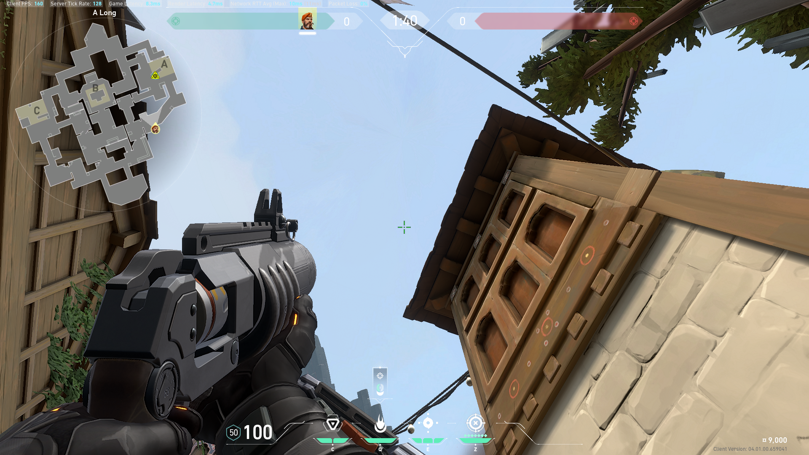
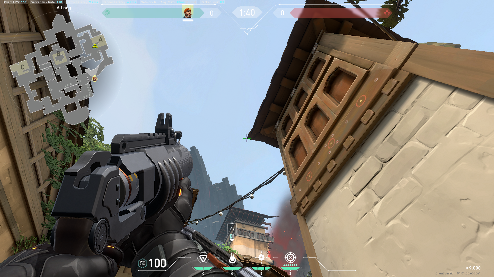
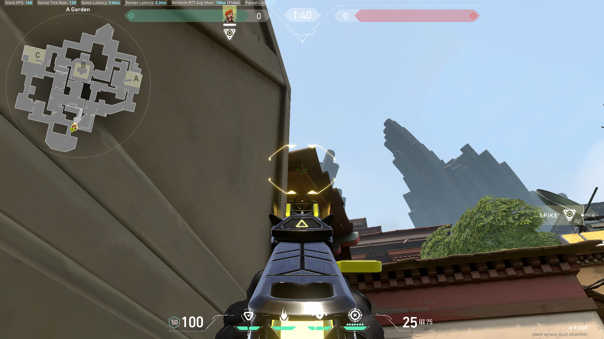
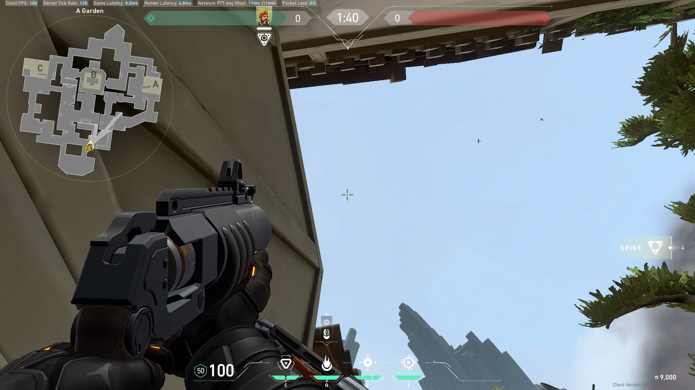
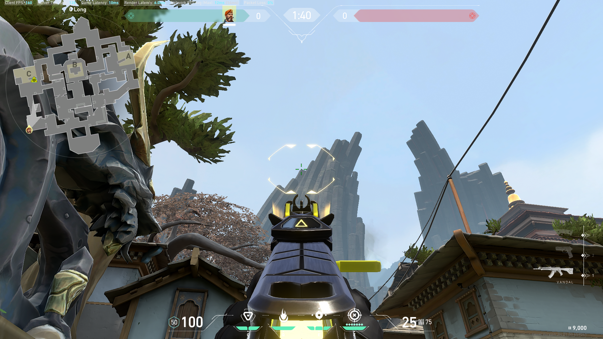
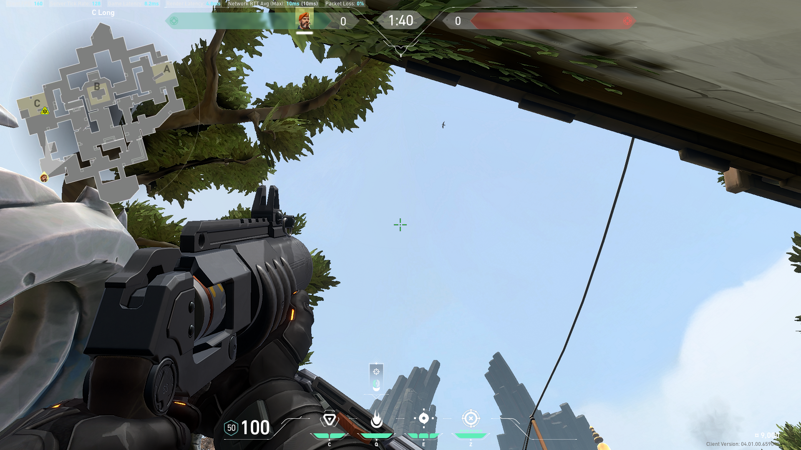

# brim

[Ascent](#ascent)

[Bind](#bind)

[Breeze](https://tea-mochi.github.io/valorant-lineups/viper.html#breeze)

Fracture - i don't play this map

[Haven](#haven)

Icebox - same

[Split](#split)

## Ascent
[A](#ascent-a) [B](#ascent-b)

## Bind
[A](#bind-a) [B](#bind-b)

## Haven
[A](#haven-a) [B](#haven-b) [C](#haven-c)

### Haven A

### Haven B

aim a little left to cover left side plant

### Haven C

aim anywhere along the roof, back against wall

aim tip of tree

